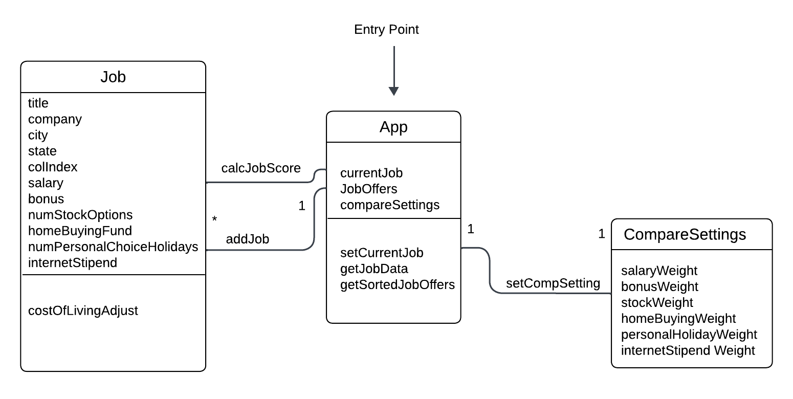

<!-- - One section for each of the individual designs, called “Design 1”, “Design 2”, and so on, that shows that design (as an embedded figure) and discusses its main pros and cons as they emerged during the team discussion.
- One section for the team design, called “Team Design”, that shows the team design (as an embedded figure), discusses the main commonalities and differences between this design and the individual ones, and concisely justifies the main design decisions.  To embed the images, you will need to include the image files in your repository and use a relative link, such as (./images/image.png) within the markdown.
- One final section, called “Summary”, that concisely summarizes the lessons learned in the process of discussing the designs, in terms of design, team work, and any other aspect that the team members consider relevant. -->

# Design Discussions

## Designs

### Design 1 (ccramer37)

Simple, single-user app design without the need for a centralized server. Denormalized
model aids in simplicity and understandability. If there's any change of requirements
it could necessitate a considerable change in design.

### Design 2 (leid3)

Similar to design-1, this is a simple single-user app design without the need for a
centralized server. Perhaps a little more single-interest per class than design-1.
Implements some features that should be handled by the UI rather than by the model. Not
enough fun shapes.

### Design 3 (rkuhl3)

A data-model-centric approach that would be better used for a large, distributed
application. Too complicated for a single-user app design.

## Team Design

The team design ended up taking leid3's foundation and combining with a few of the
successful ideation point from ccramer37's initial implementation. It was determined
that the app would be architected with simplicity in mind, aiming at serving a single
user with no need to access the internet or any centralized database. The main
differences were using the App() class to manage the state of the entire application
rather than a more generically named main() function. From there the App() class will
manage most of the functionality of the application other than storing, ranking and
creating feature-sets around Jobs, which has functionality split between the Job() class
and the CompareSettings() class (for ranking the job offers against each other).

## Summary

The team design is a combination of design 1 and design 2. The core take-aways was to
bake in simplicity from the beginning rather than building for extensibility and
creating something overly-complicated to achieve the goal at hand. With this in mind we
chose to pare-down Leid3's design to incorporate only 3 main classes, similar to the
overall design of ccramer37's individual design. For more in-depth design dicussion
please refer to [design-discussion](./design-discussion.md).

In terms of team work we found that distributing the work was a successful means of
approaching an optimal solution. We employed the "driver/navigator" system of software
pair programming where one person would be on the keyboard (driver) and another person
on the video chat would be directing that person on implementation (navigator).
