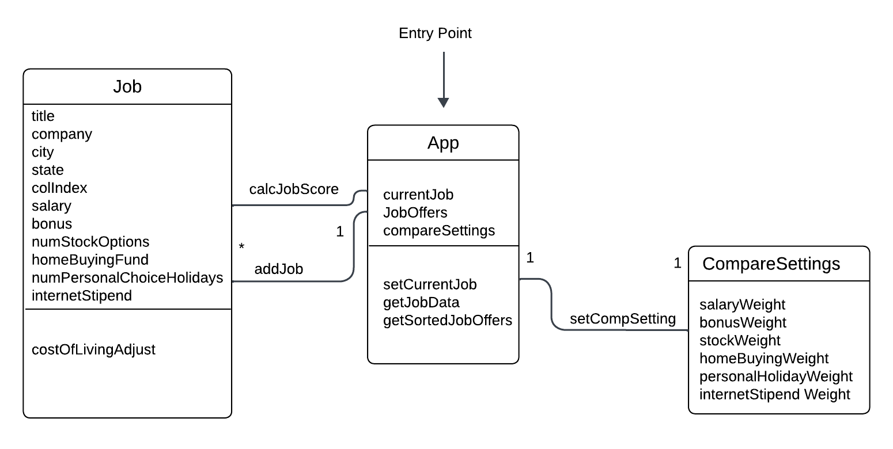

# Design Document

**Author**:

Team 003

|Name| Gatech Userid|
|---|---|
|Leayes Eid| leid3|
|Calvin Lei-Cramer| ccramer37|
|Ryan Kuhl| rkuhl3|

## 1 Design Considerations

### 1.1 Assumptions

The jobs app assumes that the user is using a smartphone or tablet with the Android operating system API version 33: Android 13. The Android smartphone or tablet must have access to the Google Play Store in order to discover and download the application locally to the smartphone. From here the user must have sufficient skill to open and use an application, and must have sufficient background knowledge of job offers and their feature set. There are no anticipated project issues at this time.

### 1.2 Constraints

The local storage limit of the device would constrain the number of job offers a user can save.
The cost of living index is baked into the application because there is no service that the app queries in order to get up-to-date information.

### 1.3 System Environment

Environment is an Android smartphone or tablet running Android 13 or newer using API version 33 or newer.

## 2 Architectural Design

UI and application logic will be separated. Each main page on the UI will be self contained to make it simple to implement and switch between pages. A simple persistence mechanism such as a text file or sqlite file will be used to save information locally on the phone.

### 2.1 Component Diagram

Since the app runs on a single system, there aren’t multiple components that are connected to each other. Due to this, a component diagram is not required.

### 2.2 Deployment Diagram

The software will be distributed to the Google Play Store as an AAB (Android App Bundle) file format build of the final codebase. From there the AAB file needs to be signed with a digital security key to ensure code is not malicious. A store listing will be made including image assets and text describing the application.

## 3 Low-Level Design

### 3.1 Class Diagram

## 4 User Interface Design

