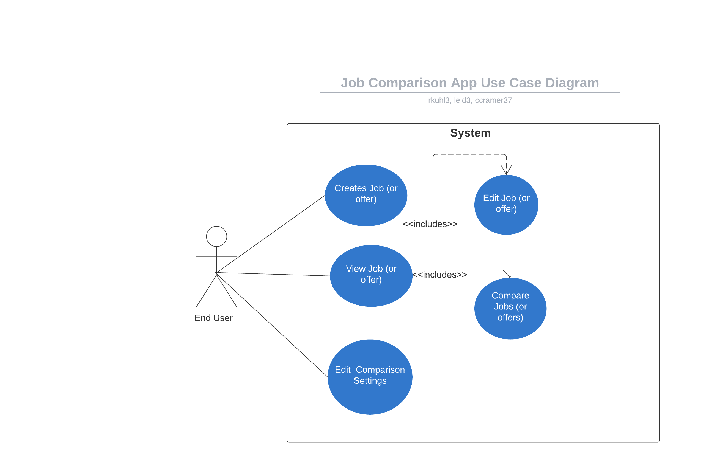

# Use Case Model
**Author**:

Team 003

| Name              | Gatech Userid |
| ----------------- | ------------- |
| Leayes Eid        | leid3         |
| Calvin Lei-Cramer | ccramer37     |
| Ryan Kuhl         | rkuhl3        |

## 1 Use Case Diagram

## 2 Use Case Descriptions
**Use case 1:**
- Requirements:  User may enter and edit their current job details
- Scenarios: user clicks on current job details button on main page, system opens view where user can enter all details for current job. User can then click save the details or cancel with any previous information retained. System returns user to main menu.
- Pre-conditions: user on main menu
- Post-conditions: app returns to main menu

**Use case 2:**
- Requirements: User may enter details for a job offer
- Scenarios: User can input a job offer - click on a button on the main page, can enter all the details for the job offer. User can then click enter another job offer, return to main menu, or compare the offer with the current job details (only available if current job is entered).
- Pre-conditions: None, other than user needs to start from main menu
- Post-conditions: Job offer is added to system if user chose to save it.

**Use case 3:**
- Requirements: User may edit details for a job offer
- Scenarios: User clicks a button to display all saved job offers and selects one to edit. The user can  then change the details of the job offer and click save or cancel to return to the list of job offers.
- Pre-conditions: Have at least one job offer saved, user starts from main menu
- Post-conditions: A job offer has the saved details if the user decides to save

**Use case 4:**
- Requirements:  User may adjust comparison settings
- Scenarios: When user is on the main menu they can click on a button to go to a view to edit the comparison settings. User may edit each comparison setting with a integer weight. User may click save or cancel to retain or throw away any changes. System returns user to the main menu afterwards. Saved comparison settings affect the ordering of the job offers.
- Pre-conditions: User is on main menu
- Post-conditions: app returns to main menu

**User case 5:**
- Requirements: user may compare two selected job offers
-Scenarios: When the user is on the main menu, user may enter a menu to compare two jobs (offer or current). A comparison will be initiated by the user via a button on the main menu which will open a list of job offers, displayed as Title and Company, ranked according to the system, and including the current job (if present). Ranking is affected by the comparison settings. User may select two jobs, which will be displayed in a tabular format side-by-side. User may choose to change the selected jobs or go back to the main menu.
- Pre-conditions: Need to have at least two job offers, or one job offer and the current job filled out
- Post-conditions: App returns to the main menu
